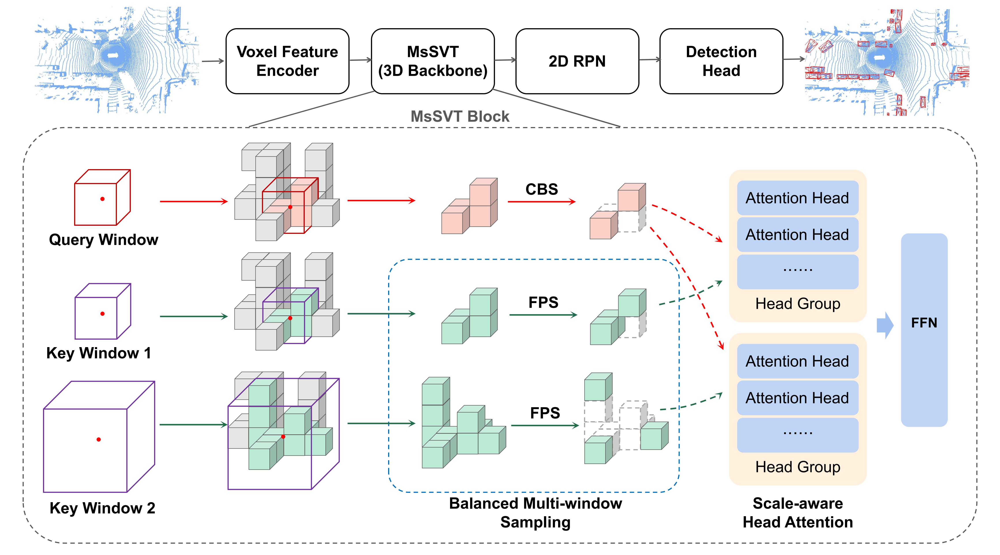

# MsSVT: Mixed-scale Sparse Voxel Transformer for 3D Object Detection on Point Clouds

Thanks for the [OpenPCDet](https://github.com/open-mmlab/OpenPCDet), we implement our method based on this toolbox. 

 

3D object detection from the LiDAR point cloud is fundamental to autonomous driving. Large-scale outdoor scenes usually feature significant variance in instance scales, thus requiring features rich in long-range and fine-grained information to support accurate detection. Recent detectors leverage the power of window-based transformers to model long-range dependencies but tend to blur out fine-grained details. To mitigate this gap, we present a novel Mixed-scale Sparse Voxel Transformer, named MsSVT, which can well capture both types of information simultaneously by the divide-and-conquer philosophy. Specifically, MsSVT explicitly divides attention heads into multiple groups, each in charge of attending to information within a particular range. All groups' output is merged to obtain the final mixed-scale features. Moreover, we provide a novel chessboard sampling strategy to reduce the computational complexity of applying a window-based transformer in 3D voxel space. To improve efficiency, we also implement the voxel sampling and gathering operations sparsely with a hash map.

### 1. Environment

- Python 3.7+
- PyTorch 1.6+
- CUDA 10.1 or higher
- pcdet (The installation of MsSVT is same as [`openpcdet`](https://github.com/open-mmlab/OpenPCDet))

### 2. Data

- Prepare [Waymo](https://waymo.com/open/download/) dataset

```shell
# Download Waymo and organize it into the following form:
├── data
│   ├── waymo
│   │   │── ImageSets
│   │   │── raw_data
│   │   │   │── segment-xxxxxxxx.tfrecord
|   |   |   |── ...
|   |   |── waymo_processed_data
│   │   │   │── segment-xxxxxxxx/
|   |   |   |── ...
│   │   │── pcdet_gt_database_train_sampled_xx/
│   │   │── pcdet_waymo_dbinfos_train_sampled_xx.pkl

# Install tf 2.1.0
# Install the official waymo-open-dataset by running the following command:
pip3 install --upgrade pip
pip3 install waymo-open-dataset-tf-2-1-0 --user

# Obtain point cloud data and generate data infos:
python -m pcdet.datasets.waymo.waymo_dataset --func create_waymo_infos --cfg_file tools/cfgs/dataset_configs/waymo_dataset.yaml
```

### 3. Train

- Train with single GPU

```shell
python train.py --cfg_file ${CONFIG_FILE}

# for mssvt,
python train.py --cfg_file cfgs/waymo_models/mssvt.yaml --extra_tag ${TAG} --workers 8
```

- Train with multiple GPUs or multiple machines

```shell
CUDA_VISIBLE_DEVICES=${GPUS} bash scripts/dist_train.sh ${NUM_GPUS} ${PORT} --cfg_file ${CONFIG_FILE}
# or 
CUDA_VISIBLE_DEVICES=${GPUS} bash scripts/slurm_train.sh ${PARTITION} ${JOB_NAME} ${NUM_GPUS} --cfg_file ${CONFIG_FILE}

# for mssvt,
CUDA_VISIBLE_DEVICES=${GPUS} bash ./scripts/dist_train.sh ${NUM_GPUS} ${PORT} --cfg_file cfgs/waymo_models/mssvt.yaml --extra_tag ${TAG} --sync_bn --workers 8
```

### 4. Test

- Test with a pretrained model:

```shell
CUDA_VISIBLE_DEVICES=${GPUS} bash ./scripts/dist_test.sh ${NUM_GPUS} ${PORT} --cfg_file ${CONFIG_FILE}

# for mssvt,
CUDA_VISIBLE_DEVICES=${GPUS} bash ./scripts/dist_test.sh ${NUM_GPUS} ${PORT} --cfg_file cfgs/waymo_models/mssvt.yaml --extra_tag ${TAG} --ckpt ${CKPT_PATH} --workers 8
```

### Citation
```latex
@inproceedings{dong2022mssvt,
  title={MsSVT: Mixed-scale Sparse Voxel Transformer for 3D Object Detection on Point Clouds},
  author={Dong, Shaocong and Ding, Lihe and Wang, Haiyang and Xu, Tingfa and Xu, Xinli and Wang, Jie and Bian, Ziyang and Wang, Ying and Li, Jianan},
  booktitle={NeurIPS},
  year={2022}
}
```
